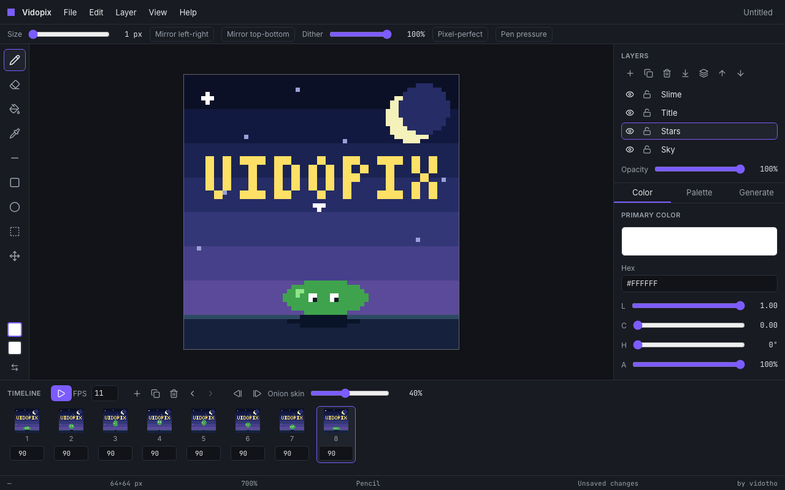
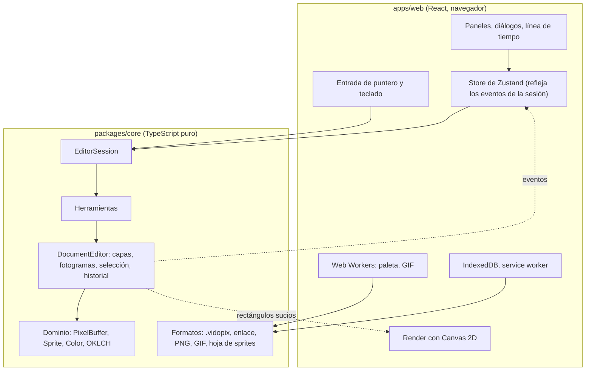

# Vidopix

[English](README.md)

Un editor de pixel art que funciona en el navegador: sin instalar nada, sin cuenta y con un generador de paletas integrado. De vidotho.


> **Estado:** v1.1.2, todas las fases de [SPEC.md](SPEC.md) terminadas. La animación de arriba se dibujó en el editor, con cuatro capas y ocho fotogramas, y se exportó con su propia exportación a GIF (`pnpm showcase` la vuelve a dibujar). El enlace a la demo se añadirá cuando la app esté desplegada (ver [Despliegue](#despliegue)).


## Objetivos

- Ser la pieza principal de un portfolio: arquitectura, algoritmos, rendimiento y diseño de producto.
- Ser usable de verdad: un artista debe poder hacer un sprite de 64×64 de principio a fin y exportarlo.
- Cargar rápido y funcionar sin conexión.

## Qué hace

**Dibujo** (fases 1 y 2)

- Lápiz, goma (1 a 16 px), cubo (contiguo o global, con tolerancia), cuentagotas, línea, rectángulo y elipse (contorno o relleno). Con Shift las líneas se limitan a 0/45/90 grados y las formas a cuadrados y círculos.
- Zoom entero de 1× a 64× anclado al puntero, desplazamiento, cuadrícula de píxeles y damero de transparencia.
- Capas (añadir, duplicar, borrar, renombrar, reordenar, ocultar, bloquear, opacidad, fusionar hacia abajo, aplanar), selección rectangular, mover, copiar, cortar, pegar y borrar.
- Deshacer y rehacer que nunca se quedan sin pasos, solo sin presupuesto de memoria (64 MB por defecto).
- Simetría, trama ordenada, lápiz pixel-perfect, presión del lápiz y gestos táctiles.
- Se puede usar entera con teclado: las flechas mueven un cursor de píxel y mantener Enter dibuja.


**Paletas** (fase 3)

- Una paleta por sprite con seis predefinidas, importación y exportación (`.gpl`, `.hex`, JSON) y extracción desde cualquier imagen (median cut, en un worker).
- Armonías OKLCH, rampas de sombreado con desplazamiento de tono, comprobador de contraste WCAG y reemplazo de color entre capas.

 

**Guardado y compartir** (fase 4)

- Se guarda solo en tu navegador (no se sube nada), lista de proyectos recientes, archivos `.vidopix` y enlaces que llevan el sprite dentro de la URL.
- Instalable y utilizable sin conexión. Interfaz en inglés y español.


**Animación** (fase 5)

- Una línea de tiempo de fotogramas con una duración cada uno, reproducción en bucle, papel cebolla, y exportación a GIF animado o a una hoja de sprites con un JSON de coordenadas. Exportación a PNG de 1× a 32×.




## Aspectos técnicos destacados

Las cifras salen de los benchmarks y de los tests de extremo a extremo de este repositorio, en la máquina del autor (Mac con Apple silicon, Chromium sin interfaz). Están medidas, no estimadas: ejecuta `pnpm bench` y `pnpm e2e` para reproducirlas en la tuya.

| Reto                                            | Objetivo        | Medido                                    |
| ----------------------------------------------- | --------------- | ----------------------------------------- |
| Relleno de 1024×1024, solo el algoritmo         | < 50 ms         | unos 12 ms                                |
| Relleno de 1024×1024, con el parche de deshacer | < 50 ms         | unos 34 ms                                |
| Tiempo por fotograma al dibujar en 256×256      | 60 fps          | 16,7 ms de media (limitado por vsync)     |
| Tiempo por fotograma con 8 capas en 256×256     | 60 fps          | 16,7 ms de media (limitado por vsync)     |
| Reproducir 32 fotogramas de 64×64               | 60 fps          | 16,7 ms de media (limitado por vsync)     |
| 500 trazos deshechos y rehechos en 256×256      | dentro de 64 MB | pasa (test unitario)                      |
| GIF de 32 fotogramas de 64×64, en un worker     | fluido          | unos 50 ms para codificar (paleta exacta) |
| JavaScript inicial (gzip)                       | < 150 kB        | 128 kB                                    |
| Lighthouse (preset de escritorio)               | ≥ 95            | 100 / 100 / 100 / 100                     |

Qué hace que se cumplan:

- **Los píxeles son RGBA empaquetado en un `Uint32Array`** que comparte memoria con `ImageData`, así que pintar no copia nada ([ADR 003](docs/adr/003-packed-rgba-in-uint32array.md)).
- **El historial guarda parches, no copias**, y tiene un presupuesto de memoria en vez de un número de pasos ([ADR 004](docs/adr/004-patch-based-history.md)). Tests de propiedades comprueban que aplicar y revertir cualquier comando deja el buffer idéntico byte a byte.
- **El render solo repinta los rectángulos sucios**, con escalas enteras en píxeles de dispositivo para que los píxeles se vean nítidos con cualquier densidad ([ADR 009](docs/adr/009-whole-number-device-pixel-scale.md)).
- **Los colores se generan en OKLCH**, y los que quedan fuera de gama se corrigen bajando el croma ([ADR 006](docs/adr/006-oklch-for-palette-tools.md)).
- **El trabajo pesado va fuera del hilo principal**: la extracción de paletas y la codificación de GIF son Web Workers cancelables ([ADR 012](docs/adr/012-palette-extraction-in-a-worker.md), [ADR 017](docs/adr/017-gif-export-in-a-worker.md)).
- **Los archivos están versionados y validados.** Los `.vidopix` y los enlaces llevan versión, los antiguos se migran y un archivo dañado devuelve un error en vez de romper la app ([ADR 007](docs/adr/007-versioned-project-format.md)).
- **La animación es una imagen por capa y por fotograma**, con `layer.buffer` apuntando siempre al fotograma activo, así que las herramientas no cambiaron ([ADR 016](docs/adr/016-one-cel-per-layer-per-frame.md)).
- **Recargar nunca pierde trabajo**: guardado automático en IndexedDB más una copia síncrona de emergencia ([ADR 013](docs/adr/013-offline-first-and-saving.md)).

## Arquitectura

Un motor en TypeScript puro (`packages/core`, sin DOM) y una app React (`apps/web`) que solo pinta y traduce eventos. El límite entre ambos se vigila en CI.



Mira [docs/architecture.md](docs/architecture.md) y los [registros de decisiones](docs/adr/README.md).

## Stack

TypeScript (estricto), React, Vite, pnpm workspaces, Zustand, Zod, gifenc, Vitest + fast-check, Playwright + axe-core, ESLint, Prettier, dependency-cruiser, GitHub Actions y Vercel. El razonamiento está en la sección 3 de [SPEC.md](SPEC.md).

## Primeros pasos

Requiere Node 24 LTS (ver `.nvmrc`) y pnpm.

```bash
pnpm install
pnpm dev
```

| Comando           | Qué hace                                                                   |
| ----------------- | -------------------------------------------------------------------------- |
| `pnpm lint`       | ESLint y los límites de arquitectura                                       |
| `pnpm typecheck`  | TypeScript en todos los paquetes                                           |
| `pnpm test`       | Tests del core (cobertura de al menos 90 %), de componentes y límites      |
| `pnpm e2e`        | Playwright y axe sobre el build de producción                              |
| `pnpm e2e:webkit` | Las mismas pruebas en WebKit (antes `pnpm exec playwright install webkit`) |
| `pnpm bench`      | Benchmarks del core                                                        |
| `pnpm build`      | Build de producción                                                        |
| `pnpm size`       | Presupuesto de tamaño del bundle                                           |
| `pnpm lighthouse` | Lighthouse sobre el build de producción                                    |
| `pnpm media`      | Regenera las capturas de este README                                       |
| `pnpm showcase`   | Vuelve a dibujar la animación de cabecera en el editor y la exporta        |

## Despliegue

`vercel.json` está listo (comando de build, carpeta de salida y una política de seguridad de contenido estricta). Para publicar: importa el repositorio en Vercel y deja los valores por defecto; cada pull request tendrá entonces una vista previa. Añade la dirección resultante al principio de este archivo.

## Límites conocidos

- La interfaz necesita al menos 768 px de ancho; los móviles no están soportados, las tablets sí.
- Las pruebas automáticas se ejecutan en Chromium y en WebKit, el motor de Safari (`pnpm e2e:webkit`). Cuatro pruebas se omiten en WebKit porque Playwright no puede conceder permisos de portapapeles, simular el táctil ni recargar sin conexión allí. Firefox y la app Safari en sí no se han probado; la instalación de la app, el portapapeles del sistema, los enlaces y el táctil necesitan una revisión manual en ellos.
- Un proyecto puede tener como máximo 1024×1024 píxeles, 64 capas, 128 fotogramas y 20 MB (y 256 MB de píxeles en memoria). Un enlace admite unos 6000 caracteres: de sobra para pixel art de colores planos, insuficiente para sprites grandes o con mucho ruido.
- Un GIF tiene una sola paleta de 256 colores y no tiene transparencia parcial, así que una imagen con más colores se reduce y los píxeles con más de la mitad transparente pasan a opacos o transparentes. Reducir miles de colores tarda medio segundo aproximadamente.
- Los nombres con los que empieza un proyecto nuevo («Untitled», «Layer 1») son texto guardado y se quedan en inglés. Los detalles de los errores al leer archivos de paleta o de proyecto son técnicos y también se quedan en inglés.

## Hoja de ruta

Ideas, no compromisos: importar un GIF o una hoja de sprites, exportar APNG o WebP animado, enlaces de capas entre fotogramas y una revisión manual en Firefox y en la app Safari.

## Cómo se construyó

Desarrollado con [Claude Code](https://claude.com/claude-code) a partir de una especificación escrita ([SPEC.md](SPEC.md)), fase a fase.

- **Qué se pidió.** Para cada una de las seis fases la especificación fijó el alcance y los criterios de aceptación. Claude Code empezó cada fase con un plan breve (tareas, archivos, riesgos), trabajó primero con tests en el motor, escribió un ADR por cada decisión relevante y abrió un pull request por fase.
- **Qué revisó y decidió el autor.** El autor aprobó el plan de cada fase y respondió a sus dudas, revisó cada pull request antes de fusionarlo y tomó las decisiones del proyecto: un repositorio público y qué valores por defecto entregar (por ejemplo, los 100 ms de duración por defecto de un fotograma y el papel cebolla en rojo y azul).
- **Qué se corrigió por el camino.** Algunos problemas solo aparecieron al medir y se arreglaron en vez de dejarlos: recargar justo después de un cambio perdía trabajo (ahora hay una copia síncrona de emergencia); la generación de código de Zod rompía la política de seguridad de contenido (ahora funciona sin `eval`); el primer bundle superó el presupuesto (los formatos de archivo y Zod se cargan bajo demanda); una comprobación de accesibilidad de Lighthouse detectó campos de duración de menos de 24 px; una revisión manual encontró la barra de opciones de herramienta apretando sus controles en ventanas estrechas; y ejecutar las pruebas en WebKit mostró que Safari, que no tiene callbacks de inactividad, cargaba demasiado tarde el código de guardado para que una recarga en los primeros instantes conservara el último cambio.

## Créditos de las paletas

Las paletas predefinidas usan los valores de color publicados en [Lospec](https://lospec.com/palette-list). Pertenecen a sus autores:

- **PICO-8**: Lexaloffle Games.
- **DawnBringer 16** y **DawnBringer 32**: Richard «DawnBringer» Fhager.
- **Sweetie 16**: GrafxKid.
- **Endesga 32**: ENDESGA.
- **Resurrect 64**: Kerrie Lake.

## Créditos y licencia

De vidotho. Licencia MIT, ver [LICENSE](LICENSE).
