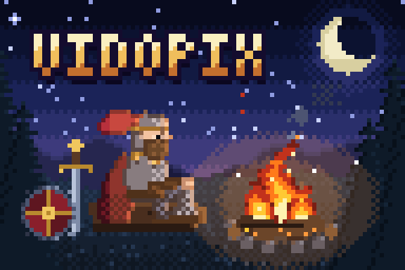
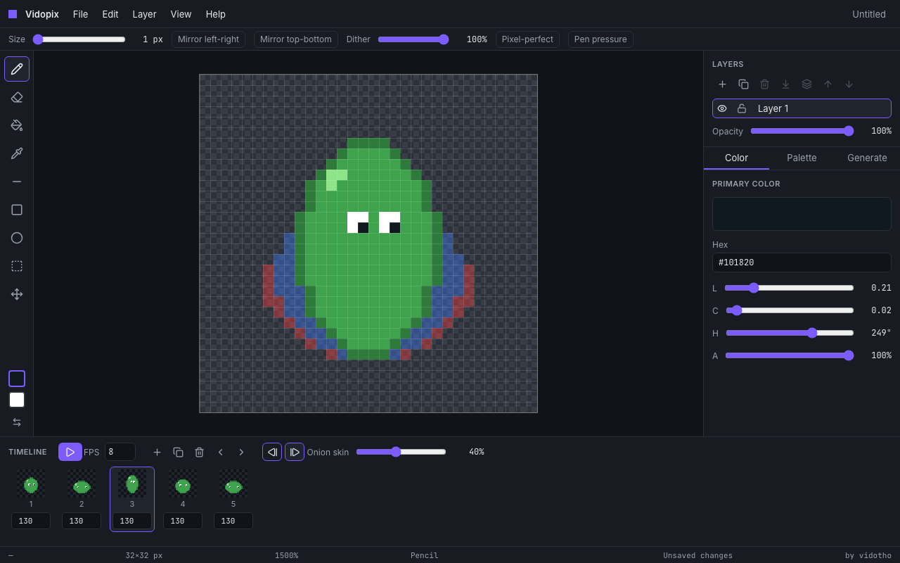
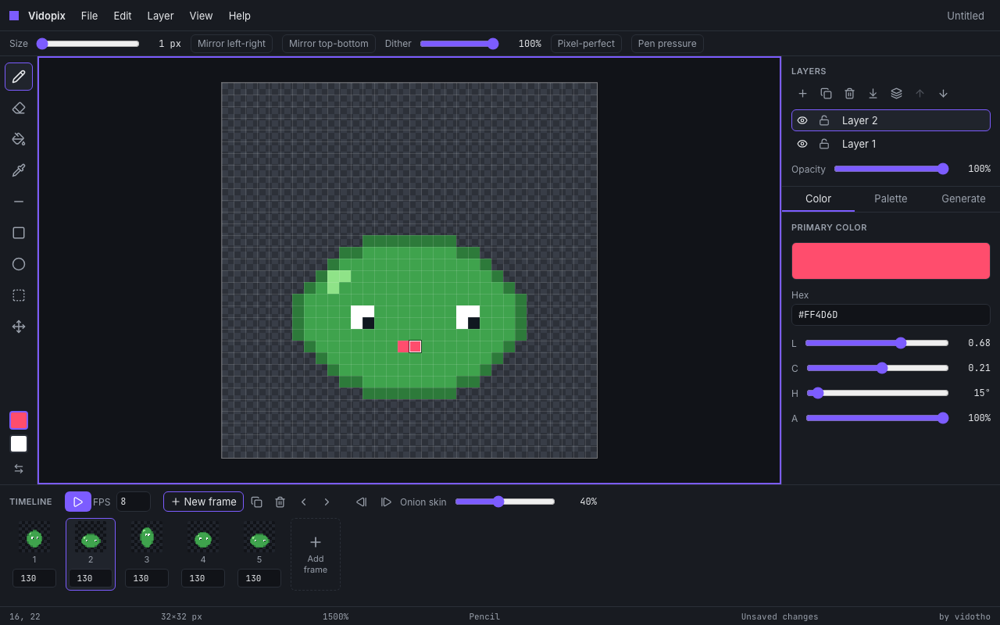
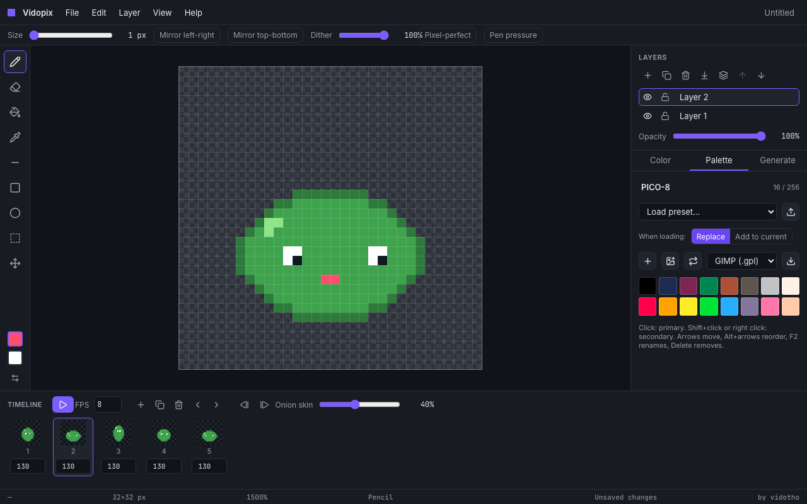
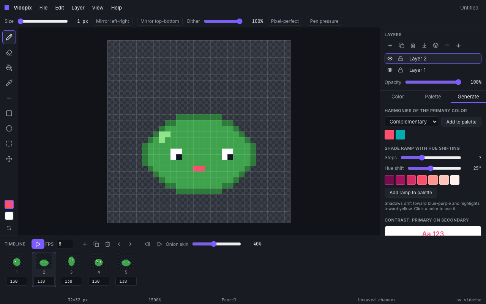
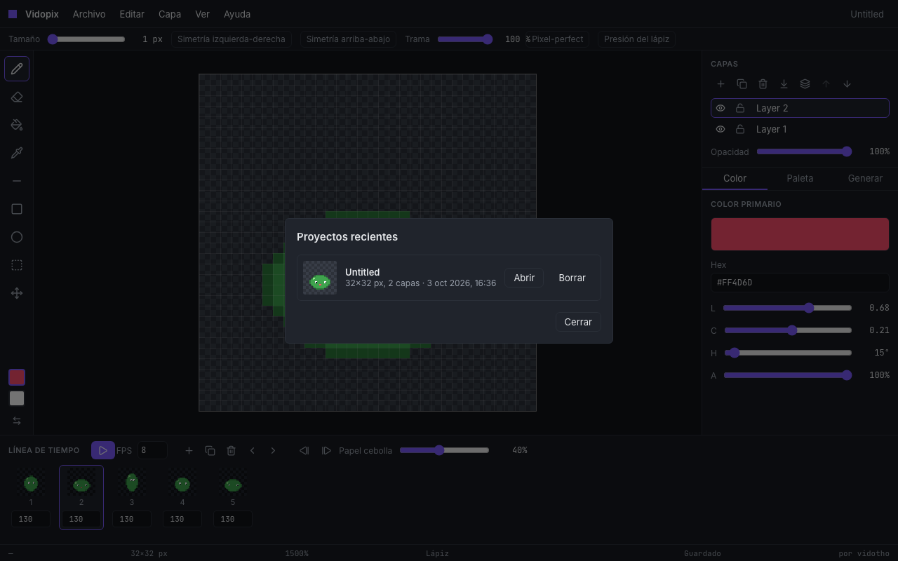
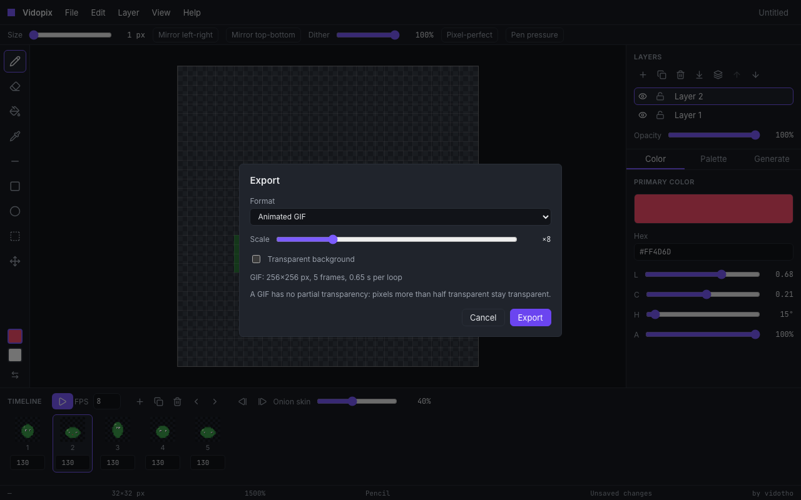
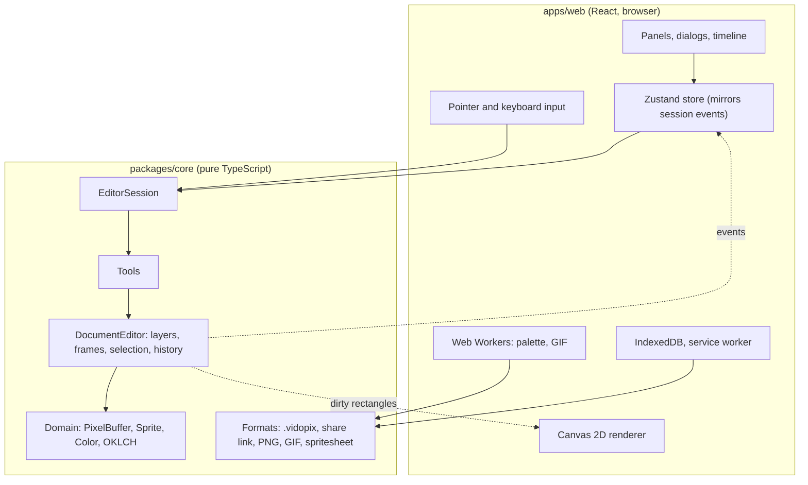

# Vidopix

[Español](README.es.md)

A pixel art editor that runs in your browser: no install, no account, and a built-in palette generator. By vidotho.



> **Status:** v1.2.3, all phases of [SPEC.md](SPEC.md) done. The animation above has five layers and twelve frames. `pnpm campfire` builds it, opens it in the editor as a project and exports it with the editor's own GIF export. **[Try it live](https://vidopix.vercel.app)** (see [Deploying](#deploying)).



## Goals

- A portfolio piece that shows architecture, algorithms, performance and product design.
- Genuinely usable: an artist should be able to make a 64×64 sprite from start to finish and export it.
- Fast to load and usable offline. The first visit asks what size of canvas to start with.

## What it does

**Drawing** (phases 1 and 2)

- Pencil, eraser (1 to 16 px), fill (contiguous or global, with tolerance), eyedropper, line, rectangle and ellipse (outline or filled). Shift constrains lines to 0/45/90 degrees and shapes to squares and circles.
- Integer zoom from 1× to 64× anchored on the pointer, panning, pixel grid and a transparency checkerboard.
- Layers (add, duplicate, delete, rename, reorder, hide, lock, opacity, merge down, flatten), rectangular selection, move, copy, cut, paste and delete.
- Undo and redo that never run out of steps, only out of a memory budget (64 MB by default).
- Symmetry, ordered dithering, a pixel-perfect pencil, pen pressure and touch gestures.
- Fully usable from the keyboard: arrow keys move a pixel cursor and holding Enter draws.



**Palettes** (phase 3)

- A palette per sprite with six presets, import and export (`.gpl`, `.hex`, JSON), and extraction from any image (median cut, in a worker).
- OKLCH harmonies, hue-shifted shade ramps, a WCAG contrast checker, and replace color across layers.

 

**Saving and sharing** (phase 4)

- Saved automatically in your browser (nothing is uploaded), a list of recent projects, `.vidopix` files, and links that carry the sprite inside the URL.
- Installable and usable offline. The interface in English and Spanish.



**Animation** (phase 5)

- A timeline of frames (add them with the New frame button or the tile at the end of the strip) with a duration each, looping playback, onion skin, and export as an animated GIF or as a spritesheet with a JSON file of coordinates. PNG export at 1× to 32×.




## Technical highlights

Numbers come from this repository's own benchmarks and end-to-end tests on the author's machine (Apple silicon Mac, headless Chromium). They are measured, not estimated; run `pnpm bench` and `pnpm e2e` to reproduce them on yours.

| Challenge                                      | Target       | Measured                              |
| ---------------------------------------------- | ------------ | ------------------------------------- |
| Flood fill 1024×1024, algorithm only           | < 50 ms      | about 12 ms                           |
| Flood fill 1024×1024, including the undo patch | < 50 ms      | about 34 ms                           |
| Frame time while drawing on 256×256            | 60 fps       | 16.7 ms mean (vsync-limited)          |
| Frame time drawing over 8 layers at 256×256    | 60 fps       | 16.7 ms mean (vsync-limited)          |
| Playing 32 frames of 64×64                     | 60 fps       | 16.7 ms mean (vsync-limited)          |
| 500 strokes undone and redone on 256×256       | within 64 MB | passes (unit test)                    |
| GIF of 32 frames of 64×64, in a worker         | responsive   | about 50 ms to encode (exact palette) |
| Initial JavaScript (gzip)                      | < 150 kB     | 128 kB                                |
| Lighthouse (desktop preset)                    | ≥ 95         | 100 / 100 / 100 / 100                 |

What makes them hold:

- **Pixels are packed RGBA in a `Uint32Array`** that shares memory with `ImageData`, so painting needs no copy ([ADR 003](docs/adr/003-packed-rgba-in-uint32array.md)).
- **History stores patches, not snapshots**, and has a memory budget instead of a step count ([ADR 004](docs/adr/004-patch-based-history.md)). Property tests check that applying and reverting any command restores the buffer byte for byte.
- **The renderer redraws only dirty rectangles**, in whole-number device-pixel scales so art pixels stay sharp at any pixel ratio ([ADR 009](docs/adr/009-whole-number-device-pixel-scale.md)).
- **Colors are generated in OKLCH**, with out-of-gamut colors fixed by lowering chroma ([ADR 006](docs/adr/006-oklch-for-palette-tools.md)).
- **Heavy work runs off the main thread**: palette extraction and GIF encoding are Web Workers you can cancel ([ADR 012](docs/adr/012-palette-extraction-in-a-worker.md), [ADR 017](docs/adr/017-gif-export-in-a-worker.md)).
- **Files are versioned and validated.** `.vidopix` files and share links carry a version, old ones are migrated, and a damaged file returns an error instead of crashing ([ADR 007](docs/adr/007-versioned-project-format.md)).
- **Animation is one cel per layer per frame**, with `layer.buffer` always pointing at the active frame, so tools needed no change ([ADR 016](docs/adr/016-one-cel-per-layer-per-frame.md)).
- **Reloading never loses work**: autosave to IndexedDB plus a synchronous emergency copy ([ADR 013](docs/adr/013-offline-first-and-saving.md)).

## Architecture

A pure TypeScript engine (`packages/core`, no DOM) and a React app (`apps/web`) that only paints and translates events. The boundary is enforced in CI.



See [docs/architecture.md](docs/architecture.md) and the [decision records](docs/adr/README.md).

## Stack

TypeScript (strict), React, Vite, pnpm workspaces, Zustand, Zod, gifenc, Vitest + fast-check, Playwright + axe-core, ESLint, Prettier, dependency-cruiser, GitHub Actions and Vercel. See [SPEC.md](SPEC.md) section 3 for the reasoning.

## Getting started

Requires Node 24 LTS (see `.nvmrc`) and pnpm.

```bash
pnpm install
pnpm dev
```

| Command           | What it does                                                           |
| ----------------- | ---------------------------------------------------------------------- |
| `pnpm lint`       | ESLint and the architecture boundaries                                 |
| `pnpm typecheck`  | TypeScript in every package                                            |
| `pnpm test`       | Core tests (coverage at least 90%), component tests, boundaries        |
| `pnpm e2e`        | Playwright and axe against the production build                        |
| `pnpm e2e:webkit` | The same tests on WebKit (`pnpm exec playwright install webkit` first) |
| `pnpm bench`      | Core benchmarks                                                        |
| `pnpm build`      | Production build                                                       |
| `pnpm size`       | Bundle size budget                                                     |
| `pnpm lighthouse` | Lighthouse on the production build                                     |
| `pnpm media`      | Regenerates the screenshots of this README                             |
| `pnpm showcase`   | Draws the slime animation with the editor's tools and exports it       |
| `pnpm campfire`   | Builds the header animation, opens it in the editor and exports it     |

## Deploying

`vercel.json` is ready (build command, output folder and a strict Content Security Policy). To publish: import the repository in Vercel and keep the defaults; every pull request then gets a preview. The live demo is deployed this way at <https://vidopix.vercel.app>.

## Known limits

- The layout needs at least 768 px of width; phones are not supported, tablets are.
- The automated tests run on Chromium and on WebKit, the engine of Safari (`pnpm e2e:webkit`). Four tests skip on WebKit because Playwright cannot grant clipboard permissions, simulate touch or reload offline there. Firefox and the Safari app itself are not tested; installing the app, the system clipboard, links and touch need a manual check there.
- A project can be at most 1024×1024 pixels, 64 layers, 128 frames and 20 MB (and 256 MB of pixels in memory). A link can carry about 6000 characters, which is plenty for flat-color pixel art and not enough for large or noisy sprites.
- A GIF has a single palette of 256 colors and no partial transparency, so an image with more colors is reduced and pixels more than half transparent become opaque or transparent. Quantizing thousands of colors takes about half a second.
- The sprite and layer names a new project starts with ("Untitled", "Layer 1") are stored text and stay in English. Details of errors from reading palette or project files are technical and stay in English too.

## Roadmap

Ideas, not commitments: import a GIF or a spritesheet, export APNG or animated WebP, per-frame layer links, and a manual pass in Firefox and in the Safari app.

## How this was built

Developed with [Claude Code](https://claude.com/claude-code) from a written specification ([SPEC.md](SPEC.md)), one phase at a time.

- **What was asked.** For each of the six phases the specification set the scope and the acceptance criteria. Claude Code started every phase with a short plan (tasks, files, risks), worked test-first in the engine, wrote an ADR for each relevant decision, and opened one pull request per phase.
- **What the author reviewed and decided.** The author approved each phase plan and answered its open questions, reviewed each pull request before it was merged, and made the project decisions: a public repository, and which defaults to ship (for example the 100 ms default frame duration and the red/blue onion skin).
- **What was corrected along the way.** Some problems showed up only when measuring, and were fixed rather than left: reloading right after a change lost work (now a synchronous emergency copy); Zod's code generation broke the Content Security Policy (now it runs without `eval`); the first bundle went over budget (file formats and Zod now load on demand); a Lighthouse accessibility check caught frame-duration fields smaller than 24 px; a manual pass found the tool options bar squeezing its controls on narrow windows; and running the tests on WebKit showed that Safari, which has no idle callbacks, loaded the saving code too late for a reload in the first moments to keep the last change.

## Palette credits

The preset palettes use the color values published on [Lospec](https://lospec.com/palette-list). They belong to their authors:

- **PICO-8**: Lexaloffle Games.
- **DawnBringer 16** and **DawnBringer 32**: Richard "DawnBringer" Fhager.
- **Sweetie 16**: GrafxKid.
- **Endesga 32**: ENDESGA.
- **Resurrect 64**: Kerrie Lake.

## Credits and license

By vidotho. MIT licensed, see [LICENSE](LICENSE).
