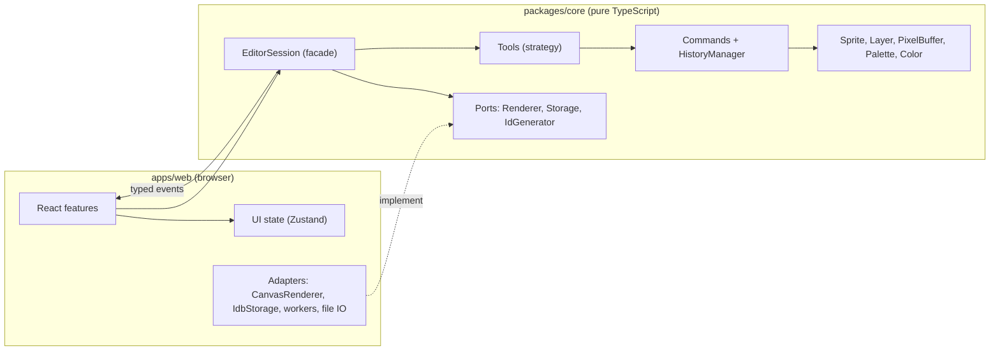

# Architecture

Vidopix follows ports and adapters: a DOM-free engine in `packages/core` and a React app in `apps/web` that only paints and translates events. See [ADR 001](adr/001-monorepo-and-dom-free-core.md) and [SPEC.md](../SPEC.md) section 4.

## Layers

Arrows only go down into the core or come out of it as events. The core never knows about React or the browser.

## Current state (Phase 4)

The engine in `packages/core` has the document model, algorithms, tools, history, color math, export and viewport math. `DocumentEditor` owns the layers, the selection, floating (moved or pasted) content, the clipboard and the history; `EditorSession` adds the tools, colors and pointer input on top (ADR 010, ADR 011). `apps/web` has the Canvas 2D renderer, pointer and keyboard input, the menus, the layers and color panels, and the dialogs. The sprite carries a palette (ADR 006, ADR 012): palette edits are pure state changes like layer edits, colors are generated in OKLCH, and extraction from images runs in a Web Worker. `apps/web` also holds persistence (IndexedDB autosave with a synchronous emergency copy), the project and share-link formats, the service worker for offline use, touch gestures and the translated interface (ADR 007, 013, 014, 015). Animation arrives in the next phase.

## Lifecycle of a stroke

1. The pointer adapter receives Pointer Events (including coalesced samples, with pointer capture) and converts screen coordinates to document pixels using the renderer's whole-number scale.
2. `EditorSession` forwards the event to the active tool.
3. The tool writes pixels through a `PatchRecorder`, which remembers the original color of each pixel; successive samples are joined with Bresenham so fast moves leave no gaps.
4. The session emits `documentChanged` with the dirty rectangle.
5. The renderer recomposes only that area (`compositeRegion`) and redraws it on the next `requestAnimationFrame`.
6. On `pointerup` the recorder closes into a `PixelPatch` and enters the history as a single command (ADR 004).

## Boundaries enforced in CI

- `core` imports nothing from `apps/` and no UI or browser-bound library.
- `features/*` do not import each other; they share code through `state/` or `design-system/`.
- No circular dependencies.

Run them with `pnpm lint`. `tools/check-boundaries.test.mjs` verifies that the rules do fail on violations.

## Keyboard drawing

The canvas is a focusable widget. Arrow keys move a pixel cursor (Alt moves 8 pixels), and holding Enter behaves like pressing the primary mouse button: it starts a stroke, arrow keys extend it, releasing Enter ends it. Escape cancels the stroke. This goes through the same `EditorSession` calls as the mouse.

## Layers and floating content

Document state that is not pixels (layers, active layer, selection) is one immutable value replaced on each change, with pixel buffers shared between versions (ADR 010). Moving or pasting pixels is a single open transaction: the content floats above the layer until it is dropped, and a cancel puts everything back (ADR 011). Every edit first drops floating content, so the history never sees a half-finished move.

## Palettes

`Sprite.palette` holds opaque colors with optional names. Edits (`palette-ops.ts`) are pure functions on the document state, so they use the same undo machinery as layers and never redraw the canvas. Color theory (harmonies, shade ramps, WCAG contrast) is pure code in `domain/color-theory.ts`. Palette files are parsed and written by `io/palette-formats.ts`, which the app loads on demand. Extracting a palette from an image is the one piece of work that leaves the main thread: `palette.worker.ts` decodes and shrinks the image, then calls the core's `medianCut`.

## Saving and sharing

`Persistence` (apps/web/src/state) listens to the session and writes the current sprite as a project file to IndexedDB shortly after each change, and to a synchronous `localStorage` copy when the page is hidden. The file format and the compact share format live in `@vidopix/core/project-formats`, which is loaded on demand. A share link is the compact form, deflated with the browser's `CompressionStream` and put in the URL fragment.

## Drawing aids

Symmetry and dithering are applied in one place, `Painter` (core/tools), which turns a requested pixel into the pixels really drawn; tools, shape previews and the pixel-perfect pencil all go through it, so what is previewed is what is committed.
