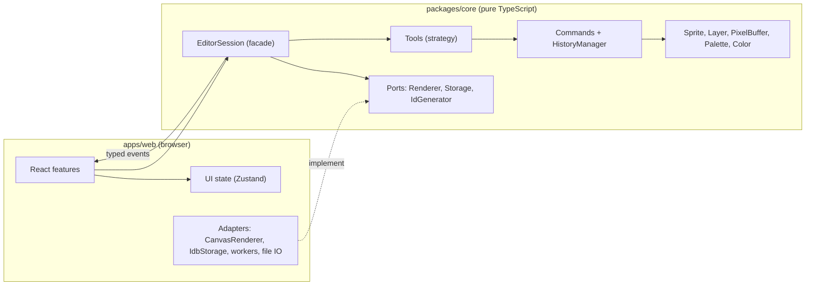

# Architecture

Vidopix follows ports and adapters: a DOM-free engine in `packages/core` and a React app in `apps/web` that only paints and translates events. See [ADR 001](adr/001-monorepo-and-dom-free-core.md) and [SPEC.md](../SPEC.md) section 4.

## Layers

Arrows only go down into the core or come out of it as events. The core never knows about React or the browser.

## Current state (Phase 0)

Only the foundations exist: `Color` (packed RGBA, hex parsing) in the core and the empty UI shell in the web app. The rest of the diagram is the target for Phases 1 to 5.

## Lifecycle of a stroke (target)

1. The canvas adapter receives Pointer Events and converts screen coordinates to document pixels.
2. `EditorSession` forwards the event to the active tool.
3. The tool changes pixels through an open command that accumulates the stroke patch.
4. The session emits `documentChanged` with the dirty rectangle.
5. The renderer recomposes only that area on the next `requestAnimationFrame`.
6. On `pointerup` the command closes and enters history as a single operation.

## Boundaries enforced in CI

- `core` imports nothing from `apps/` and no UI or browser-bound library.
- `features/*` do not import each other; they share code through `state/` or `design-system/`.
- No circular dependencies.

Run them with `pnpm lint`. `tools/check-boundaries.test.mjs` verifies that the rules do fail on violations.
